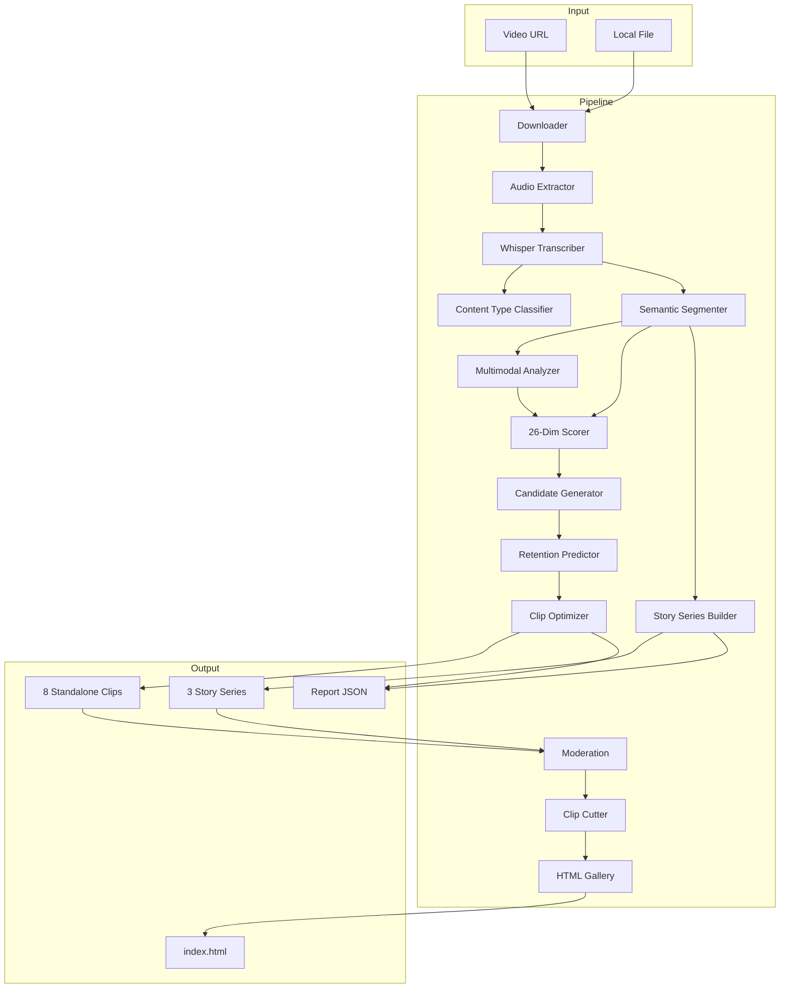
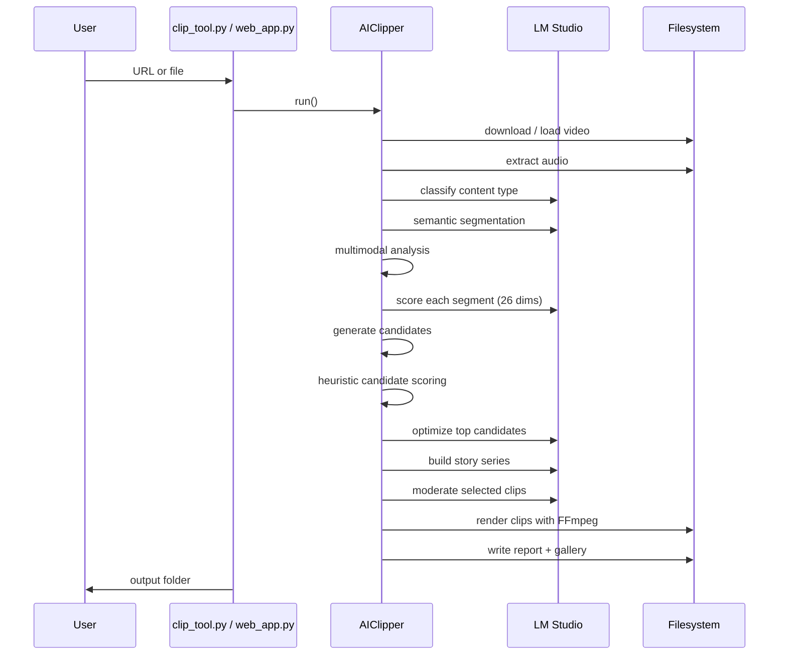
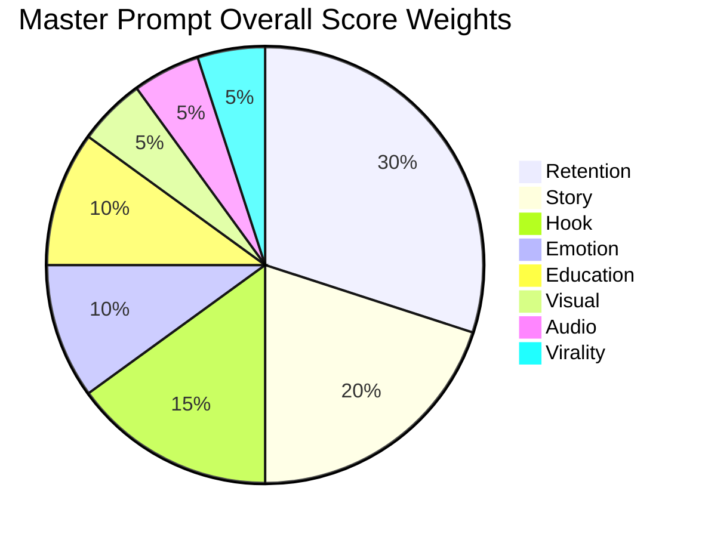

# Architecture

> High-level design of the AI Clipper Master Prompt engine.

## System overview

## Module responsibilities

| Module | File | Responsibility |
|---|---|---|
| `AIClipper` | `pipeline.py` | Orchestrates the entire pipeline |
| `ClipperConfig` | `config.py` | All tunable parameters |
| `SemanticSegmenter` | `semantic_segmenter.py` | Splits transcript by meaning |
| `ViralScorer` | `scorer.py` | 26-dimension LLM scoring |
| `CandidateGenerator` | `candidate_generator.py` | 300+ clip candidates |
| `RetentionPredictor` | `retention_predictor.py` | Engagement predictions |
| `ClipOptimizer` | `clip_optimizer.py` | Iterative boundary refinement |
| `StorySeriesBuilder` | `story_series_builder.py` | 3 continuous series |
| `MultimodalAnalyzer` | `multimodal_analyzer.py` | Audio + video signals |
| `transcriber` | `transcriber.py` | Whisper transcription |
| `clip_cutter` | `clip_cutter.py` | FFmpeg clip rendering |
| `html_gallery` | `html_gallery.py` | Output gallery |

## Data flow

## Scoring weights

## Key design decisions

1. **Local-first**: Defaults to LM Studio/Ollama; cloud is optional.
2. **Semantic over temporal**: Segmentation is meaning-driven, not time-driven.
3. **Fast candidate scoring**: Heuristic overlap scoring avoids 300+ LLM calls.
4. **Fallbacks everywhere**: Sentence boundaries, continuous arcs, and heuristic scores keep the pipeline running if LLM calls fail.
5. **Diversity enforcement**: Standalone clip selection spreads across topics and emotions.

---

#architecture #ai-clipper #system-design
