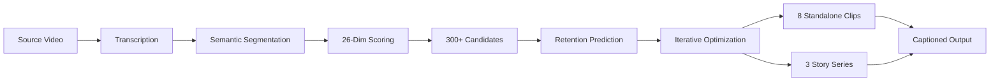

# AI Clipper — Master Prompt Engine

> Ultimate AI video clip selection and story engine. Extracts the best viral moments and continuous story arcs from any long-form video.

## Quick links

- [[🎯 Master Prompt]] — the full specification
- [[🏗️ Architecture]] — how the engine works
- [[📦 Module Index]] — all code modules
- [[🚀 Usage]] — CLI and web UI commands
- [[⚙️ Configuration]] — config options
- [[🧪 Testing]] — how to test
- [[🐛 Troubleshooting]] — common issues

## What it does

AI Clipper takes a long video (podcast, interview, lecture, stream, etc.) and produces:

1. **8 standalone clips** (~2:28 each) optimized for retention, storytelling, and virality.
2. **3 story series** (3 continuous episodes each) that tell complete narratives.

It uses a multi-step AI pipeline:



## Key principles

- **Never cut by time** — always by meaning.
- **Multimodal analysis** — audio, video, and language together.
- **Predicted retention** — rank clips by estimated performance.
- **Diversity** — 8 clips cover different topics, emotions, and audiences.
- **Story continuity** — series episodes connect with no gaps or repeats.

## Project location

```text
C:\Users\Eero\.lmstudio\apps\bionic\projects\f22bf9cd-50ce-456f-a3db-673611dcb745\workspace
```

## Status

- Version: `1.0.0`
- Engine: Master Prompt implementation
- LLM backend: LM Studio / Ollama / OpenAI-compatible
- Transcription: faster-whisper (local) or Groq Whisper API

---

#project #ai-clipper #video-editing #master-prompt #llm
